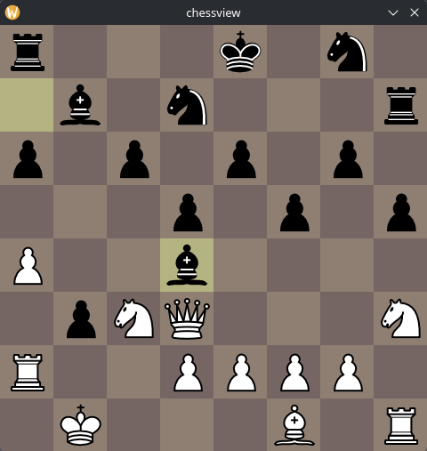

# chessview

**chessview** is an application for interacting with Chess bots and making it easy to add your own. Its main purpose is to watch your own bots play against each other, although it is a full-fledged chess engine in itself.

It was originally written sometime in 2020.



## Building

Install required dependencies:

- g++
- SDL2
- SDL2_image

Then run `make` in the root directory. It will generate a `chess` binary.

## Usage

### Command line

#### Perft

Perft mode runs a [Perft](https://www.chessprogramming.org/Perft) check using the built-in board representation to a depth of 6.

```
$ chessview --perft
Perft(1): 20 0ms
Perft(2): 400 0ms
Perft(3): 8902 1ms
...
```

#### Player list

To obtain a list of available bots:

`chessview --players`

```
$ chessview --players
blacksquares
bongcloud
centre
...
```

#### Running a bot game

To run a game, specify which bots to play for both white and black sides:

```
$ chessview white black
...
```

### Players

These are the built-in bots, ready to play against.

| Name           | Description                                                                                                                                          |
| -------------- | ---------------------------------------------------------------------------------------------------------------------------------------------------- |
| `random`       | Plays a random move from the set of available moves. Makes for interesting but silly games.                                                          |
| `whitesquares` | Ranks moves according to how many pieces fall onto white squares and prefers these. Leads to interesting aesthetic patterns.                         |
| `blacksquares` | Like `whitesquares`, but for black squares (obviously).                                                                                              |
| `min`          | Makes plays in order to minimize the number of counter moves the opponent has. Is actually quite decent at chess, since usually ends up checkmating. |
| `max`          | Like `min`, but _maximizes_ the number of responses the opponent has.                                                                                |
| `min_self`     | Minimizes the number of moves that self has.                                                                                                         |
| `max_self`     | Maximizes the number of moves that self has.                                                                                                         |
| `defensive`    | Plays in order to minimize the number of its own pieces being captured and under attack.                                                             |
| `offensive`    | Plays in order to maximize the number of opponent pieces being captured and under attack.                                                            |
| `suicidal`     | Opposite of `defensive`; plays in order to maximize the number of its own pieces being captures and under attack.                                    |
| `pacifist`     | Opposite of `offensive`; plays in order to minimize the number of opponent pieces being captured and under attack.                                   |
| `centre`       | Plays in order to control the centre d and e files.                                                                                                  |
| `edge`         | Opposite of `centre`; plays to control the a and h files.                                                                                            |
| `aggressive`   | Plays to push its pieces to the opposite rank. Pushes one piece and then keeps moving that piece back and forth. Quite boring.                       |
| `passive`      | Plays to prevent pushing its pieces at all; insanely boring (and terrible.)                                                                          |
| `bongcloud`    | Opens with bongcloud (move pawn, then King) and then plays randomly.                                                                                 |

## Features

- Implements the more complex rules of chess, including **en passant**, **castling** and **most stalemate conditions** (with the exception of three-fold repetition).
- Generates all legal moves for a position.
- Ability to easily add additional bots into the application.

## Planned

- Many more dumb but interesting bots.
- Threefold repetition stalemate [rule](https://en.wikipedia.org/wiki/Threefold_repetition).
- Support for PGN string imports (to watch existing games).
- FEN import, to start from a known position.
- Tournaments between bots.
- Recording of games to files (probably in PGN notation).
